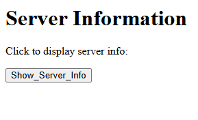
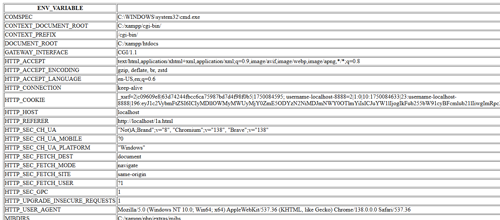

# Program 1a

## Objective
Display various Server Information like Server Name, Server Software, Server Protocol, CGI Revision, and other environment variables using HTML and Perl CGI.

## Setup Instructions

### Prerequisites
1. XAMPP installed on your system
2. Apache server configured and running
3. Perl module enabled in XAMPP

## Technologies Used
- **HTML**: For creating the user interface
- **Perl CGI**: For server-side processing and environment variable retrieval
- **Apache Server**: Web server (via XAMPP)

## Source Code

### HTML File (1a.html)
```html
<html>
<body>
  <h1>Server Information</h1>
  <p>Click to display server info:</p>
  <form action="http://localhost/cgi-bin/1a.pl">
    <input type="submit" value="Show_Server_Info">
  </form>
</body>
</html>
```

**File Location**: Save as `1a.html` in `C:\xampp\htdocs\`

### Perl CGI Script (1a.pl)

```perl
#!C:/xampp/perl/bin/perl.exe
print "Content-type: text/html\n\n";
print "<html><head><title>Environment Variables</title></head><body><center>"
    . "<table border=1><tr><th>ENV_VARIABLE</th><th>Value</th></tr>\n";
foreach my $key (sort keys %ENV) {
    print "<tr><td>$key</td><td>$ENV{$key}</td></tr>\n";
}
print "</table></center></body></html>\n";
```

**File Location**: Save as `1a.pl` in `C:\xampp\cgi-bin\`

## How to Run

1. **Start Apache Server**
   - Open XAMPP Control Panel
   - Click "Start" next to Apache

2. **Access the Program**
   - Open your web browser
   - Navigate to: `http://localhost/1a.html`

3. **Execute the Program**
   - Click the "Show_Server_Info" button
   - View the server environment variables

## Code Explanation

### HTML Components

- **Form Element**: Creates a form that submits to the Perl CGI script
- **Submit Button**: Triggers the CGI script execution
- **Action Attribute**: Points to the Perl script location

### Perl CGI Components

- **Shebang Line**: `#!C:/xampp/perl/bin/perl.exe` - Specifies Perl interpreter path
- **Content-Type Header**: `print "Content-type: text/html\n\n";` - Tells browser to expect HTML
- **%ENV Hash**: Contains all environment variables
- **foreach Loop**: Iterates through all environment variables
- **HTML Table**: Formats output in a structured table

## Output 

<p align="center">
  
  <br>
  
</p>