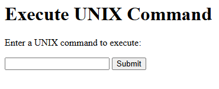

# Program 1b

## Objective
Program to accept UNIX command from a HTML form and to display the output of the 
command executed. 

## Setup Instructions

### Prerequisites
1. XAMPP installed on your system
2. Apache server configured and running
3. Perl module enabled in XAMPP

## Technologies Used
- **HTML**: For creating the user interface
- **Perl CGI**: For server-side processing and environment variable retrieval
- **Apache Server**: Web server (via XAMPP)

## Source Code

### HTML File (1b.html)
```html
<html>
  <body>
    <h1>Execute UNIX Command</h1>
    <p>Enter a UNIX command to execute:</p>
    <form action="http://localhost/cgi-bin/1b.pl">
      <input type="text" id="com" name="com"/>
      <input type="submit" value="Submit" />
    </form>
  </body>
</html>
```

**File Location**: Save as `1b.html` in `C:\xampp\htdocs\`

### Perl CGI Script (1b.pl)

```perl
#!C:/xampp/perl/bin/perl.exe 
use CGI ':standard';  
print "Content-type:text/html\n\n";  
$c=param('com');  
system($c);  
exit(0);
```

**File Location**: Save as `1b.pl` in `C:\xampp\cgi-bin\`

## How to Run

1. **Start Apache Server**
   - Open XAMPP Control Panel
   - Click "Start" next to Apache

2. **Access the Program**
   - Open web browser
   - Navigate to: `http://localhost/1b.html`

3. **Execute the Program**
   - Enter a valid UNIX command
   - Click "Submit"
   - View the command output in your browser

## Code Explanation

- The HTML file contains a form with a single text input labeled “Enter UNIX Command:”. When submitted, it sends the command to “http://localhost/cgi-bin/1b.pl”.

- In the Perl script, we read the value of the “com” parameter using the CGI module’s "param" function, store it in the variable `$c`, and then execute it on the server with `system($c)`.

- The command’s output is displayed directly in the browser. This demonstrates a basic interface for remotely issuing commands via a web page, though caution is advised when using it in production due to security risks.

## Output


