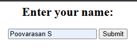
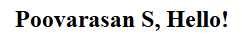
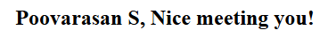
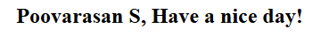
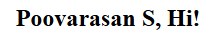

# Program 2a

## Objective
Program to accept the User Name and display a greeting message.

## Installing XAMPP
1. Download XAMPP from the official Apache Friends site.
2. Run the installer and select the components.
3. Complete installation and launch XAMPP Control Panel.

## Setup Instructions

### Prerequisites
1. XAMPP installed on your system
2. Apache server configured and running
3. Perl module enabled in XAMPP

## Technologies Used
- **HTML**: For user interface
- **Perl CGI**: For server-side processing
- **Apache Server**: via XAMPP

## Source Code

### HTML File (2a.html)
```html
<html>
  <body>
    <form action="http://localhost/cgi-bin/2a.pl">
      <center>
        <h2>Enter your name:</h2>
        <input type="text" name="name" />
        <input type="submit" value="Submit" />
      </center>
    </form>
  </body>
</html>
```

**File Location**: Save as `2a.html` in `C:\xampp\htdocs\`

### Perl CGI Script (2a.pl)

```perl
#!C:/xampp/perl/bin/perl.exe
use CGI':standard';my@a=("Hello","Hi","Nice meeting you","Have a nice day");
print header(),"<html><head><title>Greeting</title></head><body><center><h2>",
(param('name')||'Guest'),", $a[int rand @a]!</h2></center></body></html>";
```

**File Location**: Save as `2a.pl` in `C:\xampp\cgi-bin\`

## How to Run
1. **Start Apache Server**
     - Open XAMPP Control Panel
     - Click "Start" next to Apache
2. **Open 2a.html**
     - Navigate to: `http://localhost/2a.html`
3. **Submit Your Name**
     - Click "Submit" to see the greeting message

## Code Explanation
- The HTML form collects the user's name.
- On submission, it calls the Perl script.
- The Perl script retrieves the name parameter and randomly selects a greeting from an array.
- The output is displayed as a personalized welcome message.

## Output




