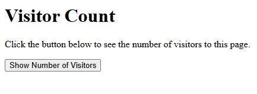
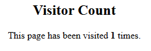

# Program 2b

## Objective
Program to keep track of the number of visitors visited the webpage and display the counter with proper headings.

## Setup Instructions

### Prerequisites
1. XAMPP installed on your system
2. Apache server configured and running
3. Perl module enabled in XAMPP

## Technologies Used
- **HTML**: For creating the user interface
- **Perl CGI**: For server-side processing and environment variable retrieval
- **Apache Server**: Web server (via XAMPP)

## Source Code

### HTML File (2b.html)
```html
<html>
  <body>
    <form action="http://localhost/cgi-bin/2b.pl">
      <center>
        <input type="submit" value="Show Number of Visitors" />
      </center>
    </form>
  </body>
</html>
```

**File Location**: Save as `2b.html` in `C:\xampp\htdocs\`

### Perl CGI Script (2b.pl)

```perl
#!C:/xampp/perl/bin/perl.exe
use strict;
use warnings;
use CGI;

my $q = CGI->new;
print $q->header('text/html');

my $f = 'count.txt';
my $c;

# Declare $fh only once
my $fh;
# Read count
if (open($fh, '<', $f)) {
    $c = <$fh> || 0;
    close($fh);
} else {
    $c = 0;
}
# Write updated count
open($fh, '>', $f) or die $!;
print $fh ++$c;
close($fh);

print "<html><body><center><h2>Visitor Count</h2><p>This page has been visited <strong>$c</strong> times.</p></center></body></html>";
```

**File Location**: Save as `2b.pl` in `C:\xampp\cgi-bin\`

## How to Run

1. **Start Apache Server**
   - Open XAMPP Control Panel
   - Click "Start" next to Apache

2. **Access the Program**
   - Open web browser
   - Navigate to: `http://localhost/2b.html`

3. **Execute the Program**


## Code Explanation
- The HTML form submits to “2b.pl”, which reads and increments a counter from “count.txt”.
- If “count.txt” does not exist, it is created with an initial value of zero.
- Each visit updates the count, stores the new value back into the file, and displays it.
- This ensures the total number of visitors is persisted between page loads.

## Output 


