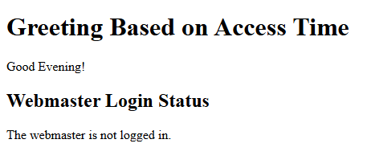
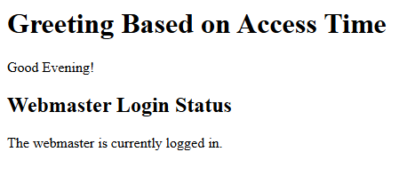

# Program 3

## Objective
Program to display a greeting based on the access time of the Web server. Also to verify whether the webmaster is currently logged in. 

## Setup Instructions

### Prerequisites
1. XAMPP installed on your system
2. Apache server configured and running
3. Perl module enabled in XAMPP

## Technologies Used
- **HTML**: For creating the user interface
- **Perl CGI**: For server-side processing and environment variable retrieval
- **Apache Server**: Web server (via XAMPP)

## Source Code

### HTML File (3.html)
```html
<html>
<body>
  <form action="http://localhost/cgi-bin/3.pl">
    <center>
      <input type="submit" value="Show Greeting" />
    </center>
  </form>
</body>
</html>
```

**File Location**: Save as `3.html` in `C:\xampp\htdocs\`

### Perl CGI Script (3.pl)

```perl
#!C:/xampp/perl/bin/perl.exe
use strict;
use warnings;
use CGI ':standard';
use POSIX 'strftime';

my $hour = strftime("%H", localtime);
my $greeting = $hour < 12 ? "Good Morning!" : $hour < 18 ? "Good Afternoon!" : "Good Evening!";
my $login_status = 0 ? "The webmaster is currently logged in." : "The webmaster is not logged in.";

print header,
    start_html("Greeting and Login Check"),
    h1("Greeting Based on Access Time"),
    p($greeting),
    h2("Webmaster Login Status"),
    p($login_status),
    end_html;

```

**File Location**: Save as `3.pl` in `C:\xampp\cgi-bin\`

## How to Run

1. **Start Apache Server**
   - Open XAMPP Control Panel
   - Click "Start" next to Apache

2. **Access the Program**
   - Open web browser
   - Navigate to: `http://localhost/3.html`

3. **Execute the Program**
   - Click the "Show Greeting" button
   - View the greeting based on the access time of the Web server and verify whether the webmaster is currently logged in or not. 

## Code Explanation
- The Perl script obtains the current hour using POSIX's strftime function.
- Depending on the hour, it assigns a greeting string, such as "Good Morning!" if the hour is less than 12.
- The variable `$login_status` is hardcoded to "not logged in" here (0 ? ...). In a real scenario, this could be replaced by an actual check to see if the webmaster is logged in.
- The final output is displayed in a simple HTML format using Perl CGI functions like `start_html`, `h1`, and `p`.


## Output 


