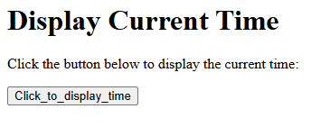

# Program 4

## Objective
Program to display a digital clock which displays the current time of the server.  

## Setup Instructions

### Prerequisites
1. XAMPP installed on your system
2. Apache server configured and running
3. Perl module enabled in XAMPP

## Technologies Used
- **HTML**: For creating the user interface
- **Perl CGI**: For server-side processing and environment variable retrieval
- **Apache Server**: Web server (via XAMPP)

## Source Code

### HTML File (4.html)
```html
<html>
<body>
  <h1>Display Current Time</h1>
  <p>Click the button below to display the current time:</p>
  <form action="http://localhost/cgi-bin/4.pl">
    <input type=submit value=Click_to_display_time>
  </form>
</body>
</form>
</html>
```

**File Location**: Save as `4.html` in `C:\xampp\htdocs\`

### Perl CGI Script (4.pl)

```perl
#!C:/xampp/perl/bin/perl.exe
use strict;
use warnings;
use CGI qw(:standard :html3);

my ($s,$m,$h) = localtime;
print header(-Refresh => 1),
    start_html('Digital Clock'),
    div({align => "center"}, "The current server time is $h:$m:$s"),
    br,
    "In words, the time is - $h hours, $m minutes, $s seconds",
    end_html;
```

**File Location**: Save as `4.pl` in `C:\xampp\cgi-bin\`

## How to Run

1. **Start Apache Server**
   - Open XAMPP Control Panel
   - Click "Start" next to Apache

2. **Access the Program**
   - Open web browser
   - Navigate to: `http://localhost/4.html`

3. **Execute the Program**


## Code Explanation

- The HTML file provides a button that, when clicked, sends a request to the Perl CGI script (`4.pl`).
- The Perl script uses the `localtime` function to get the current server time (hours, minutes, seconds).
- The CGI `header(-Refresh => 1)` sends a header to the browser to refresh the page every second, creating a digital clock effect.
- The script displays the time in both numeric format (`$h:$m:$s`) and in words (`$h hours, $m minutes, $s seconds`).
- All output is wrapped in simple HTML using CGI module functions for formatting.

## Output 


