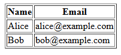

# Program 5

## Objective
Program to display the current contents of the table in a database.  

## Setup Instructions

### Prerequisites
1. XAMPP installed on your system
2. Apache server configured and running
3. MySQL module enabled in XAMPP

## Technologies Used
- **HTML**: For creating the user interface
- **PHP**: For server-side processing and database interaction
- **Apache Server**: Web server (via XAMPP)
- **MySQL**: Database management

## Source Code

### HTML File (5.html)
```html
<html>
<body>
  <h2>Click the button to view the database contents</h2>
  <form method="POST" action="5.php">
    <input type="submit" value="Show Records">
  </form>
</body>
</html>
```

**File Location**: Save as `5.html` in `C:\xampp\htdocs\`

### PHP Script (5.php)
```php
<?php
$conn = new mysqli('localhost', 'root', '', 'test');
if ($conn->connect_error) die("Connection failed: " . $conn->connect_error);
$res = $conn->query("SELECT name, age FROM info1");
echo "<table border='1'><tr><th>Name</th><th>Age</th></tr>";
if ($res->num_rows)
    while($r = $res->fetch_assoc())
        echo "<tr><td>", htmlspecialchars($r['name']), "</td><td>", htmlspecialchars($r['age']), "</td></tr>";
else
    echo "<tr><td colspan='2'>No records found</td></tr>";
echo "</table>";
$conn->close();
?>
```

**File Location**: Save as `5.php` in `C:\xampp\htdocs\`

## How to Run

1. **Start Apache Server**
   - Open XAMPP Control Panel
   - Click "Start" next to Apache

2. **Create Database and Table in phpMyAdmin**
   - Open your web browser and go to: `http://localhost/phpmyadmin`
   - Click on the **Databases** tab.
   - In the "Create database" field, enter `test` and click **Create**.
   - Select the `test` database from the left sidebar.
   - Click on the **SQL** tab and run the following SQL to create the table:
     ```sql
     CREATE TABLE info1 (
       name VARCHAR(50),
       age INT
     );
     ```
   - (Optional) Insert some sample data:
     ```sql
     INSERT INTO info1 (name, age) VALUES
       ('Alice', 23),
       ('Bob', 30);
     ```

3. **Access the Program**
   - Open your web browser
   - Navigate to: `http://localhost/5.html`

4. **Execute the Program**
   - Click the "Show Records" button to view the contents of the database table.

## Code Explanation

- **5.html**: Provides a simple HTML form with a button. When clicked, it sends a POST request to `5.php`.
- **5.php**: 
  - Connects to the MySQL database `test` using the default root user.
  - Executes a query to fetch `name` and `age` columns from the `info1` table.
  - Displays the results in an HTML table. If no records are found, it shows a message accordingly.
  - Closes the database connection after fetching the data.

## Output 

When you click "Show Records", the output will display the contents of the `info1` table in a tabular format. Example:

<p align="center">
  
  <br>
  
</p>