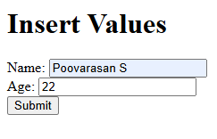
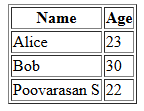

# Program 6

## Objective
Program to insert new name and age information entered by the user into the database.

## Setup Instructions

### Prerequisites
1. XAMPP installed on your system
2. Apache server configured and running
3. MySQL module enabled in XAMPP

## Technologies Used
- **HTML**: For creating the user interface
- **PHP**: For server-side processing and database interaction
- **Apache Server**: Web server (via XAMPP)
- **MySQL**: Database management

## Source Code

### HTML File (6.html)
```html
<html>
<body>
  <h1>Insert Values</h1>
  <form method="POST" action="6.php">
    Name: <input type="text" name="name"><br>
    Age: <input type="number" name="age"><br>
    <input type="submit" value="Submit">
  </form>
</body>
</html>
```

**File Location**: Save as `6.html` in `C:\xampp\htdocs\`

### PHP Script (6.php)
```php
<?php
$conn = new mysqli('localhost', 'root', '', 'test');
if ($conn->connect_error) die("Connection failed: " . $conn->connect_error);
if (!empty($_POST['name']) && !empty($_POST['age'])) {
    $stmt = $conn->prepare("INSERT INTO info1 (name, age) VALUES (?, ?)");
    $stmt->bind_param("si", $_POST['name'], $_POST['age']);
    $stmt->execute();
    $stmt->close();
}
$res = $conn->query("SELECT name, age FROM info1");
echo "<table border='1'><tr><th>Name</th><th>Age</th></tr>";
while ($row = $res->fetch_assoc())
    echo "<tr><td>" . htmlspecialchars($row['name']) . "</td><td>" . htmlspecialchars($row['age']) . "</td></tr>";
echo "</table>";
$conn->close();
?>
```

**File Location**: Save as `6.php` in `C:\xampp\htdocs\`

## How to Run

1. **Start Apache Server**
   - Open XAMPP Control Panel
   - Click "Start" next to Apache

2. **Create Database and Table in phpMyAdmin**
   - Open your web browser and go to: `http://localhost/phpmyadmin`
   - Click on the **Databases** tab.
   - In the "Create database" field, enter `test` and click **Create**.
   - Select the `test` database from the left sidebar.
   - Click on the **SQL** tab and run the following SQL to create the table:
     ```sql
     CREATE TABLE info1 (
       name VARCHAR(50),
       age INT
     );
     ```
   - (Optional) Insert some sample data:
     ```sql
     INSERT INTO info1 (name, age) VALUES
       ('Alice', 23),
       ('Bob', 30);
     ```

3. **Access the Program**
   - Open your web browser
   - Navigate to: `http://localhost/6.html`

4. **Execute the Program**
   - Enter a name and age, then click "Submit". The new record will be inserted and the table will be displayed.

## Code Explanation

- **6.html**: Presents a form for the user to enter a name and age. On submission, the data is sent via POST to `6.php`.
- **6.php**: 
  - Connects to the MySQL database `test`.
  - If the form is submitted with both name and age, inserts the new record into the `info1` table using a prepared statement.
  - Fetches and displays all records from the table in an HTML table.
  - Closes the database connection.

## Output 

<p align="center">
  
  <br>
  
</p>