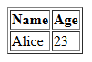
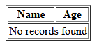

# Program 7

## Objective
Program to query the database and to display the result on a webpage. 

## Setup Instructions

### Prerequisites
1. XAMPP installed on your system
2. Apache server configured and running
3. MySQL module enabled in XAMPP

## Technologies Used
- **HTML**: For creating the user interface
- **PHP**: For server-side processing and database interaction
- **Apache Server**: Web server (via XAMPP)
- **MySQL**: Database management

## Source Code

### HTML File (7.html)
```html
<html>
<body>
  <h2>Query Database</h2>
  <form method="POST" action="7.php">
    Enter Name: <input type="text" name="name">
    <input type="submit" value="Search">
  </form>
</body>
</html>
```

**File Location**: Save as `7.html` in `C:\xampp\htdocs\`

### PHP Script (7.php)
```php
<?php
$conn = new mysqli('localhost', 'root', '', 'test');
if ($conn->connect_error) die("Connection failed");
if (!empty($_POST['name'])) {
    $stmt = $conn->prepare("SELECT name, age FROM info1 WHERE name = ?");
    $stmt->bind_param("s", $_POST['name']);
    $stmt->execute();
    $res = $stmt->get_result();
    echo "<table border='1'><tr><th>Name</th><th>Age</th></tr>";
    if ($row = $res->fetch_assoc())
        do echo "<tr><td>", htmlspecialchars($row['name']), "</td><td>", htmlspecialchars($row['age']), "</td></tr>";
        while ($row = $res->fetch_assoc());
    else
        echo "<tr><td colspan='2'>No records found</td></tr>";
    echo "</table>";
    $stmt->close();
} else echo "Please enter a name to search.";
$conn->close();
?>
```

**File Location**: Save as `7.php` in `C:\xampp\htdocs\`

## How to Run

1. **Start Apache Server**
   - Open XAMPP Control Panel
   - Click "Start" next to Apache

2. **Create Database and Table in phpMyAdmin**
   - Open your web browser and go to: `http://localhost/phpmyadmin`
   - Click on the **Databases** tab.
   - In the "Create database" field, enter `test` and click **Create**.
   - Select the `test` database from the left sidebar.
   - Click on the **SQL** tab and run the following SQL to create the table:
     ```sql
     CREATE TABLE info1 (
       name VARCHAR(50),
       age INT
     );
     ```
   - Insert some sample data:
     ```sql
     INSERT INTO info1 (name, age) VALUES
       ('Alice', 23),
       ('Bob', 30);
     ```

3. **Access the Program**
   - Open your web browser
   - Navigate to: `http://localhost/7.html`

4. **Execute the Program**
   - Enter a name and click "Search". The matching records will be displayed in a table.

## Code Explanation

- **7.html**: Presents a form for the user to enter a name. On submission, the data is sent via POST to `7.php`.
- **7.php**: 
  - Connects to the MySQL database `test`.
  - If a name is entered, queries the `info1` table for records matching the name using a prepared statement.
  - Displays the results in an HTML table. If no records are found, a message is shown.
  - Closes the database connection.

## Output 

<p align="center">
  
  
  <br>
  
  
</p>