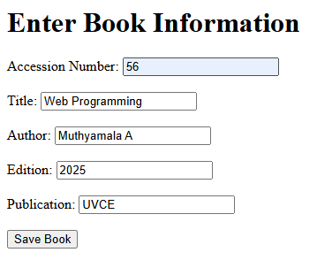

# Program 8

## Objective
Program to accept book information viz. Accession number, title, authors, edition and publication from a webpage and to store those in a database. 

## Setup Instructions

### Prerequisites
1. XAMPP installed on your system
2. Apache server configured and running
3. MySQL module enabled in XAMPP

## Technologies Used
- **HTML**: For creating the user interface
- **PHP**: For server-side processing and database interaction
- **Apache Server**: Web server (via XAMPP)
- **MySQL**: Database management

## Source Code

### HTML File (8.html)
```html
<html>
<body>
  <h1>Enter Book Information</h1>
  <form action="8.php" method="POST">
    <label>Accession Number:</label>
    <input type="text" name="accession_number" required><br><br>
    <label>Title:</label>
    <input type="text" name="title" required><br><br>
    <label>Author:</label>
    <input type="text" name="author" required><br><br>
    <label>Edition:</label>
    <input type="text" name="edition" required><br><br>
    <label>Publication:</label>
    <input type="text" name="publication" required><br><br>
    <input type="submit" value="Save Book">
  </form>
</body>
</html>
```

**File Location**: Save as `8.html` in `C:\xampp\htdocs\`

### PHP Script (8.php)
```php
<?php
$conn = new mysqli("localhost", "root", "", "library");
if ($conn->connect_error) die("Connection failed: " . $conn->connect_error);

$stmt = $conn->prepare("INSERT INTO books (accession_number, title, author, edition, publication) VALUES (?, ?, ?, ?, ?)");
$stmt->bind_param("sssss", $_POST['accession_number'], $_POST['title'], $_POST['author'], $_POST['edition'], $_POST['publication']);

echo $stmt->execute() ? "New book record created successfully" : "Error: " . $stmt->error;

$stmt->close();
$conn->close();
?>
```

**File Location**: Save as `8.php` in `C:\xampp\htdocs\`

## How to Run

1. **Start Apache Server**
   - Open XAMPP Control Panel
   - Click "Start" next to Apache

2. **Create Database and Table in phpMyAdmin**
   - Open your web browser and go to: `http://localhost/phpmyadmin`
   - Click on the **Databases** tab.
   - In the "Create database" field, enter `library` and click **Create**.
   - Select the `library` database from the left sidebar.
   - Click on the **SQL** tab and run the following SQL to create the table:
     ```sql
     CREATE TABLE books (
       accession_number VARCHAR(20) PRIMARY KEY,
       title VARCHAR(100),
       author VARCHAR(100),
       edition VARCHAR(20),
       publication VARCHAR(100)
     );
     ```
   - (Optional) Insert some sample data:
     ```sql
     INSERT INTO books (accession_number, title, author, edition, publication) VALUES
       ('A001', 'C Programming', 'Dennis Ritchie', '2nd', 'PHI'),
       ('A002', 'Data Structures', 'Mark Weiss', '3rd', 'Pearson');
     ```

3. **Access the Program**
   - Open your web browser
   - Navigate to: `http://localhost/8.html`

4. **Execute the Program**
   - Enter the book details and click "Save Book". The new book record will be inserted into the database.

## Code Explanation

- **8.html**: Presents a form for the user to enter book details (accession number, title, author, edition, publication). On submission, the data is sent via POST to `8.php`.
- **8.php**: 
  - Connects to the MySQL database `library`.
  - Inserts the submitted book details into the `books` table using a prepared statement.
  - Displays a success message if the record is inserted, or an error message otherwise.
  - Closes the database connection.

## Output 

<p align="center">
  
  <br>
  
</p>