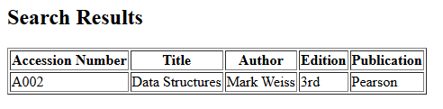

# Program 9

## Objective
Program to search a book for a title given by the user on a webpage and display the search results with proper headings. 

## Setup Instructions

### Prerequisites
1. XAMPP installed on your system
2. Apache server configured and running
3. MySQL module enabled in XAMPP

## Technologies Used
- **HTML**: For creating the user interface
- **PHP**: For server-side processing and database interaction
- **Apache Server**: Web server (via XAMPP)
- **MySQL**: Database management

## Source Code

### HTML File (9.html)
```html
<html>
<body>
  <h1>Search book by book title</h1>
  <form action="9.php" method="GET">
    <label> Enter Book Title</label>
    <input type="text" name="title" required><br><br>
    <input type="submit" value="search">
  </form>
</body>
</html>
```

**File Location**: Save as `9.html` in `C:\xampp\htdocs\`

### PHP Script (9.php)
```php
<?php
$conn = new mysqli("localhost", "root", "", "library");
if ($conn->connect_error) die("Connection failed: " . $conn->connect_error);
$title = $conn->real_escape_string($_GET['title']);
$sql = "SELECT accession_number, title, author, edition, publication FROM books WHERE title LIKE '%$title%'";
$result = $conn->query($sql);
if ($result->num_rows) {
    echo "<h2>Search Results</h2><table border='1'><tr><th>Accession Number</th><th>Title</th><th>Author</th><th>Edition</th><th>Publication</th></tr>";
    while ($row = $result->fetch_assoc())
        echo "<tr><td>" . htmlspecialchars($row["accession_number"]) . "</td><td>" . htmlspecialchars($row["title"]) . "</td><td>" . htmlspecialchars($row["author"]) . "</td><td>" . htmlspecialchars($row["edition"]) . "</td><td>" . htmlspecialchars($row["publication"]) . "</td></tr>";
    echo "</table>";
} else echo "No books found with title '$title'";
$conn->close();
?>
```

**File Location**: Save as `9.php` in `C:\xampp\htdocs\`

## How to Run

1. **Start Apache Server**
   - Open XAMPP Control Panel
   - Click "Start" next to Apache

2. **Create Database and Table in phpMyAdmin**
   - Open your web browser and go to: `http://localhost/phpmyadmin`
   - Click on the **Databases** tab.
   - In the "Create database" field, enter `library` and click **Create**.
   - Select the `library` database from the left sidebar.
   - Click on the **SQL** tab and run the following SQL to create the table:
     ```sql
     CREATE TABLE books (
       accession_number VARCHAR(20) PRIMARY KEY,
       title VARCHAR(100),
       author VARCHAR(100),
       edition VARCHAR(20),
       publication VARCHAR(100)
     );
     ```
   - (Optional) Insert some sample data:
     ```sql
     INSERT INTO books (accession_number, title, author, edition, publication) VALUES
       ('A001', 'C Programming', 'Dennis Ritchie', '2nd', 'PHI'),
       ('A002', 'Data Structures', 'Mark Weiss', '3rd', 'Pearson');
     ```

3. **Access the Program**
   - Open your web browser
   - Navigate to: `http://localhost/9.html`

4. **Execute the Program**
   - Enter a book title and click "search". The matching records will be displayed in a table.

## Code Explanation

- **9.html**: Presents a form for the user to enter a book title. On submission, the data is sent via GET to `9.php`.
- **9.php**: 
  - Connects to the MySQL database `library`.
  - Searches the `books` table for titles matching the user's input using a LIKE query.
  - Displays the results in an HTML table with proper headings. If no records are found, a message is shown.
  - Closes the database connection.

## Output 

<p align="center">
  
  
  <br>
  
  
</p>