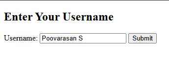

# Program 10a

## Objective

A simple web application to accept a username and display a personalized greeting message using Java Servlet technology.

## Setup

 1. **Configure Tomcat in Eclipse**
    - Make sure Tomcat is started before setup in Eclipse.
    - Window > Preferences > Server > Runtime Environments > Add > Apache > Tomcat v9.0 > Next
    - Browse to Tomcat folder (e.g., `C:\Tomcat9`)
    - Click Finish, then Apply and Close

2. **Create a Dynamic Web Project**
    - File > New > Dynamic Web Project
    - Enter Project Name (e.g., `Program10a`)
    - Select Target Runtime as Apache Tomcat v9.0
    - Keep default configuration and click Finish

3. **Add Static Web Content**
    - Navigate to `src/main/webapp` (create this folder structure if not already present)
    - Right-click on `webapp` > New > File > Name it `greeting.html`
    - Use the following code:

    ```html
    <!DOCTYPE html>
    <html>
    <head>
    <title>Greeting Form</title>
    </head>
    <body>
        <h2>Enter Your Username</h2>
        <form action="greetingServlet" method="GET">
            Username: <input type="text" name="username" required>
            <input type="submit" value="Submit">
        </form>
    </body>
    </html>
    ```

4. **Create the Servlet**
    - Right-click on Java Resources > src → New > Servlet
    - Package name: `greetingPackage`
    - Class name: `GreetingClass`
    - Click Finish
    - Replace the generated code with:

    ```java
    package greetingPackage;
    import java.io.IOException;
    import java.io.PrintWriter;
    import javax.servlet.ServletException;
    import javax.servlet.annotation.WebServlet;
    import javax.servlet.http.HttpServlet;
    import javax.servlet.http.HttpServletRequest;
    import javax.servlet.http.HttpServletResponse;

    @WebServlet("/greetingServlet")
    public class GreetingClass extends HttpServlet {
        private static final long serialVersionUID = 1L;
        protected void doGet(HttpServletRequest request, HttpServletResponse response) throws ServletException, IOException {
            String username = request.getParameter("username");
            response.setContentType("text/html");
            PrintWriter out = response.getWriter();
            out.println("<!DOCTYPE html>");
            out.println("<html><head><title>Greeting</title></head><body>");
            out.println("<h1>Hello, " + escapeHtml(username) + "! Welcome to our website.</h1>");
            out.println("</body></html>");
        }

        // Optional: prevent XSS if user types scripts
        private String escapeHtml(String input) {
            if (input == null) return "";
            return input.replaceAll("&", "&amp;")
                        .replaceAll("<", "&lt;")
                        .replaceAll(">", "&gt;");
        }
    }
    ```

---

## How to Run

1. Right-click the project > Run As > Run on Server
2. Choose Tomcat v9.0
3. Open a browser and go to:  
   `http://localhost:8080/Program10a/greeting.html`

---

## Output 

<p align="center">
  
  <br>
  
</p>