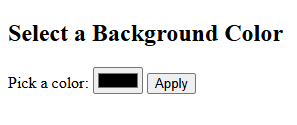

# Program 10b

## Objective
Program to change the background color of the page based on the color selected by the user.

## Setup

1. **Configure Tomcat in Eclipse**
    - Make sure Tomcat is started before setup in Eclipse.
    - Window > Preferences > Server > Runtime Environments > Add > Apache > Tomcat v9.0 > Next
    - Browse to Tomcat folder (e.g., `C:\Tomcat9`)
    - Click Finish, then Apply and Close

2. **Create a Dynamic Web Project**
    - File > New > Dynamic Web Project
    - Enter Project Name (e.g., `Program10b`)
    - Select Target Runtime as Apache Tomcat v9.0
    - Keep default configuration and click Finish

3. **Add Static Web Content**
    - Navigate to `src/main/webapp` (create this folder structure if not already present)
    - Right-click on `webapp` > New > File > Name it `color.html`
    - Use the following code:

    ```html
    <!-- color.html -->
    <!DOCTYPE html>
    <html>
    <head>
        <title>Choose Background Color</title>
    </head>
    <body>
        <h2>Select a Background Color</h2>
        <form action="colorServlet" method="GET">
            <label for="color">Pick a color:</label>
            <input type="color" name="color" id="color">
            <input type="submit" value="Apply">
        </form>
    </body>
    </html>
    ```

4. **Create the Servlet**
    - Right-click on Java Resources > src → New > Servlet
    - Package name: `colorPackage`
    - Class name: `ColorClass`
    - Click Finish
    - Replace the generated code with:

    ```java
    // filepath: src/colorPackage/ColorClass.java
    package colorPackage;
    import java.io.IOException;
    import java.io.PrintWriter;
    import javax.servlet.ServletException;
    import javax.servlet.annotation.WebServlet;
    import javax.servlet.http.HttpServlet;
    import javax.servlet.http.HttpServletRequest;
    import javax.servlet.http.HttpServletResponse;

    @WebServlet("/colorServlet")
    public class ColorClass extends HttpServlet {
        private static final long serialVersionUID = 1L;
        protected void doGet(HttpServletRequest request,
                         HttpServletResponse response) throws ServletException, IOException {
            String color = request.getParameter("color");
            if (color == null || color.isEmpty()) {
                color = "#ffffff"; // default to white
            }
            response.setContentType("text/html");
            PrintWriter out = response.getWriter();
            out.println("<!DOCTYPE html>");
            out.println("<html><head><title>Colored Page</title></head>");
            out.println("<body style='background-color:" + escapeHtml(color) + ";'>");
            out.println("<h1>Background color changed to: " + escapeHtml(color) + "</h1>");
            out.println("<a href='color.html'>Choose another color</a>");
            out.println("</body></html>");
        }

        // Prevent XSS
        private String escapeHtml(String input) {
            if (input == null) return "";
            return input.replaceAll("&", "&amp;")
                        .replaceAll("<", "&lt;")
                        .replaceAll(">", "&gt;");
        }
    }
    ```

---

## How to Run

1. Right-click the project > Run As > Run on Server
2. Choose Tomcat v9.0
3. Open a browser and go to:  
   `http://localhost:8080/Program10b/color.html`

---

## Output 

<p align="center">
  
  <br>
  
</p>