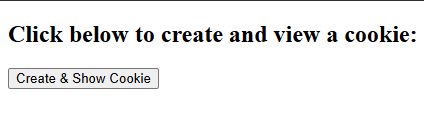
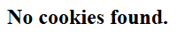
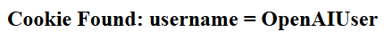

# Program 12

## Objective
Program to create and display a cookie. 

## Setup

1. **Configure Tomcat in Eclipse**
    - Make sure Tomcat is started before setup in Eclipse.
    - Window > Preferences > Server > Runtime Environments > Add > Apache > Tomcat v9.0 > Next
    - Browse to Tomcat folder (e.g., `C:\Tomcat9`)
    - Click Finish, then Apply and Close

2. **Create a Dynamic Web Project**
    - File > New > Dynamic Web Project
    - Enter Project Name (e.g., `Program12`)
    - Select Target Runtime as Apache Tomcat v9.0
    - Keep default configuration and click Finish

3. **Add Static Web Content**
    - Navigate to `src/main/webapp` (create this folder structure if not already present)
    - Right-click on `webapp` > New > File > Name it `cookies.html`
    - Use the following code:

    ```html
    <!-- cookies.html -->
    <!DOCTYPE html>
    <html>
    <head>
        <title>Cookie Example</title>
    </head>
    <body>
        <h2>Click below to create and view a cookie:</h2>
        <form action="cookiesServlet" method="get">
            <input type="submit" value="Create & Show Cookie">
        </form>
    </body>
    </html>
    ```

4. **Create the Servlet**
    - Right-click on Java Resources > src → New > Servlet
    - Package name: `cookiesPackage`
    - Class name: `CookiesClass`
    - Click Finish
    - Replace the generated code with:

    ```java
    // filepath: src/cookiesPackage/CookiesClass.java
    package cookiesPackage;

    import java.io.*;
    import javax.servlet.*;
    import javax.servlet.http.*;
    import javax.servlet.annotation.WebServlet;

    @WebServlet("/cookiesServlet")
    public class CookiesClass extends HttpServlet {
        protected void doGet(HttpServletRequest request, HttpServletResponse response)
                throws ServletException, IOException {

            response.setContentType("text/html");
            PrintWriter out = response.getWriter();

            // Step 1: Create a cookie
            Cookie cookie = new Cookie("username", "OpenAIUser");
            cookie.setMaxAge(60 * 60); // 1 hour
            response.addCookie(cookie);

            // Step 2: Read cookies
            Cookie[] cookies = request.getCookies();
            String message = "No cookies found.";

            if (cookies != null) {
                for (Cookie c : cookies) {
                    if ("username".equals(c.getName())) {
                        message = "Cookie Found: " + c.getName() + " = " + c.getValue();
                        break;
                    }
                }
            }

            // Step 3: Display result
            out.println("<!DOCTYPE html>");
            out.println("<html><head><title>Cookie Result</title></head><body>");
            out.println("<h2>" + message + "</h2>");
            out.println("</body></html>");
        }
    }
    ```

---

## How to Run

1. Right-click the project > Run As > Run on Server
2. Choose Tomcat v9.0
3. Open a browser and go to:  
   `http://localhost:8080/Program12/cookies.html`

---

## Output 

<p align="center">
  
  <br>
  
  <br>
  
</p>