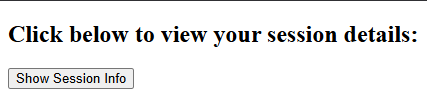
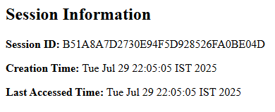

# Program 13

## Objective
Program to create a session and display session information viz. session ID, creation time, and last accessed time.

## Setup

1. **Configure Tomcat in Eclipse**
    - Make sure Tomcat is started before setup in Eclipse.
    - Window > Preferences > Server > Runtime Environments > Add > Apache > Tomcat v9.0 > Next
    - Browse to Tomcat folder (e.g., `C:\Tomcat9`)
    - Click Finish, then Apply and Close

2. **Create a Dynamic Web Project**
    - File > New > Dynamic Web Project
    - Enter Project Name (e.g., `Program13`)
    - Select Target Runtime as Apache Tomcat v9.0
    - Keep default configuration and click Finish

3. **Add Static Web Content**
    - Navigate to `src/main/webapp` (create this folder structure if not already present)
    - Right-click on `webapp` > New > File > Name it `session.html`
    - Use the following code:

    ```html
    <!-- session.html -->
    <!DOCTYPE html>
    <html>
    <head>
        <title>Session Info Example</title>
    </head>
    <body>
        <h2>Click below to view your session details:</h2>
        <form action="sessionServlet" method="get">
            <input type="submit" value="Show Session Info">
        </form>
    </body>
    </html>
    ```

4. **Create the Servlet**
    - Right-click on Java Resources > src → New > Servlet
    - Package name: `sessionPackage`
    - Class name: `SessionClass`
    - Click Finish
    - Replace the generated code with:

    ```java
    // filepath: src/sessionPackage/SessionClass.java
    package sessionPackage;

    import java.io.*;
    import java.util.Date;
    import javax.servlet.*;
    import javax.servlet.http.*;
    import javax.servlet.annotation.WebServlet;

    @WebServlet("/sessionServlet")
    public class SessionClass extends HttpServlet {
        protected void doGet(HttpServletRequest request, HttpServletResponse response)
                throws ServletException, IOException {

            response.setContentType("text/html");
            PrintWriter out = response.getWriter();

            // Step 1: Create or get existing session
            HttpSession session = request.getSession(true);

            // Step 2: Get session information
            String sessionId = session.getId();
            Date creationTime = new Date(session.getCreationTime());
            Date lastAccessed = new Date(session.getLastAccessedTime());

            // Step 3: Display session information
            out.println("<!DOCTYPE html>");
            out.println("<html><head><title>Session Info</title></head><body>");
            out.println("<h2>Session Information</h2>");
            out.println("<p><strong>Session ID:</strong> " + sessionId + "</p>");
            out.println("<p><strong>Creation Time:</strong> " + creationTime + "</p>");
            out.println("<p><strong>Last Accessed Time:</strong> " + lastAccessed + "</p>");
            out.println("</body></html>");
        }
    }
    ```

---

## How to Run

1. Right-click the project > Run As > Run on Server
2. Choose Tomcat v9.0
3. Open a browser and go to:  
   `http://localhost:8080/Program13/session.html`

---

## Output 

<p align="center">
  
  <br>
  
</p>